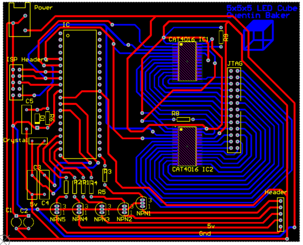

# LED-Cube

LED Cube Display that projects custom animations using a 5x5x5 matrix of LEDs. The display utilizes an ATmega32 microcontroller utilizes two 16-channel LED drivers.

- Project Video (YouTube): https://www.youtube.com/watch?v=go_lMkQ88TE
- Display Multiplexing: https://en.wikipedia.org/wiki/Multiplexed_display

  

<h2> Table of Contents</h2>

1. [Software Used](#software)
2. [ESC Driver Circuit](#escdriver)
    - [PWM Overview](#escpwm)
    - [Parts List](#escpartslist) 
3. [Clock Circuit](#clockcircuit)
    - [LED Driver](#leddriver)
    - [Timer Overview](#clocktimer) 
    - [Parts List](#clockpartslist) 
4. [Power Consumption](#powerconsumption)
5. [Schematics](#schematics)
    - [ESC Driver Schematic](#escschematic)
    - [Clock Schematic](#clockschematic)
6. [STL Viewer](#stlviewer)
    - [Case Base](#casebase)
    - [Case Top](#casetop)

## 1. Software Used
- Microchip Studio: https://www.microchip.com/en-us/tools-resources/develop/microchip-studio
- AVRDUDE (Flash Uploader): https://github.com/avrdudes/avrdude
- KiCad (PCB Design): https://www.kicad.org
- AutoDesk Fusion 360 Personal (Case Design): https://www.autodesk.com/products/fusion-360/personal
  
What I learned
* Learned the concept of Binary Code Modulation to adjust LED brightness.
* Learned the concept of LED Multiplexing.
* Increased code organization skills.
* Increased my knowledge on reusable functions.

Component List
* Atmega 32 Microcontroller
* Cat4016 LED Driver x2
* Blue LED x 125
* BC635 Transistor x5
* 16 Mghz Crystal x1
* 10k resistor
* 1k resistor x5
* 2.2k resistor x2
* 22pF capacitor x2
* 100pF capacitor x3
* 1N914 Diode
* Header Pins x43

Circuit Board Images  

