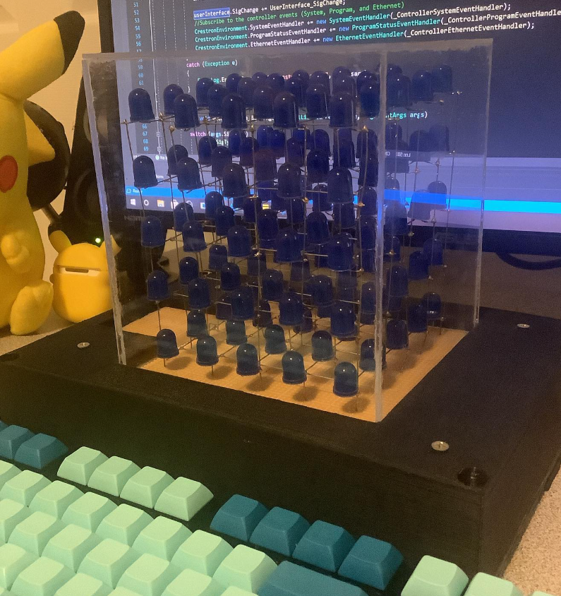
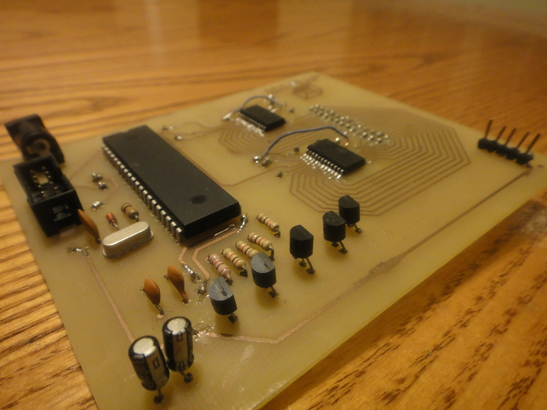
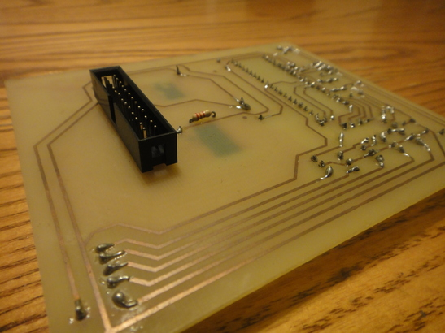
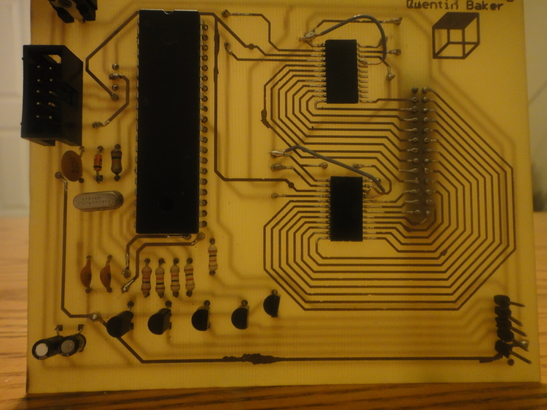
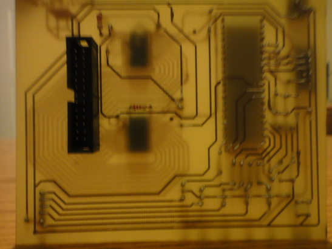
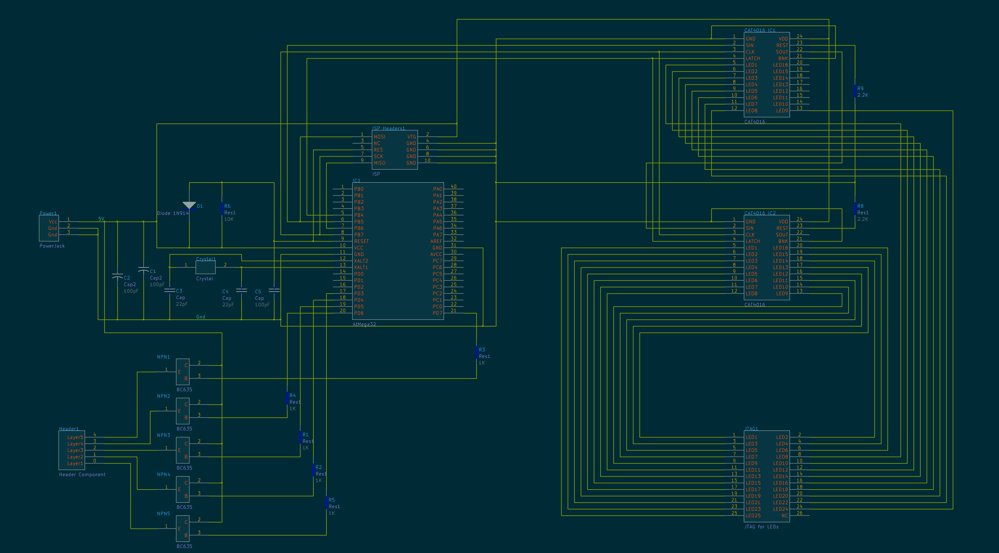

# LED-Cube

LED Cube Display that projects custom animations using a 5x5x5 matrix of LEDs. The display utilizes an ATmega32 microcontroller utilizes two 16-channel LED drivers.

- Project Video (YouTube): https://www.youtube.com/watch?v=go_lMkQ88TE
- Display Multiplexing: https://en.wikipedia.org/wiki/Multiplexed_display

  

<h2> Table of Contents</h2>

1. [Software Used](#software)
2. [Cube Circuit](#cubecircuit)
    - [LED Driver](#leddriver)
    - [Parts List](#clockpartslist) 
3. [Power Consumption](#powerconsumption)
4. [Schematics](#schematics)
    - [Clock Schematic](#cubeschematic)

## 1. Software Used
- Microchip Studio: https://www.microchip.com/en-us/tools-resources/develop/microchip-studio
- AVRDUDE (Flash Uploader): https://github.com/avrdudes/avrdude
- KiCad (PCB Design): https://www.kicad.org
- AutoDesk Fusion 360 Personal (Case Design): https://www.autodesk.com/products/fusion-360/personal

## 2. Display Circuit 
This circuit projects custom animations by utilizing multiplexing and bit-angle modulation for LED dimming. Each layer of the cube consists of 25 LEDs, with their anodes soldered together and their cathodes connected to the CAT4016 constant current sink outputs. The LEDs are arranged into 25 vertical columns, each containing five LEDs stacked across the layers. The cathodes of LEDs within each column are connected together, allowing control of entire columns simultaneously. Five transistors act as switches to control each layer, allowing 5V to be applied to the corresponding anode mesh when the associated transistor is activated. Through multiplexing, all five layers can appear illuminated simultaneously. Communication with the LED drivers is achieved via the SPI protocol.

  
  
  
  

### LED Drivers 
The LED Drivers are chained together. Each driver must receive two bytes of data to control their 16 output channels. Four bytes of data must be sent to the first driver in order to control all 32 output channels. The LEDs are mounted in order (starting from the top left corner of the 32 pin header connector) from 1 to 25. The table below shows which output channel each LED is connected to. 

|_**Cat4016 1 Outputs**_|LED Number|--|_**Cat4016 2 Outputs**_|LED Number|
|:--:|:--:|:--:|:--:|:--:|
|**Byte0**||--|**Byte2**||
|Out0|LED1|--|Out0|LED17|
|Out1|LED2|--|Out1|LED18|
|Out2|LED3|--|Out2|LED19|
|Out3|LED4|--|Out3|LED20|
|Out4|LED5|--|Out4|LED21|
|Out5|LED6|--|Out5|LED22|
|Out6|LED7|--|Out6|LED23|
|Out7|LED8|--|Out7|LED24|
|||--|||
|**Byte1**||--|**Byte3**||
|Out8|LED9|--|Out8|LED25|
|Out9|LED10|--|Out9|N/A|
|Out10|LED11|--|Out10|N/A|
|Out11|LED12|--|Out11|N/A|
|Out12|LED13|--|Out12|N/A|
|Out13|LED14|--|Out13|N/A|
|Out14|LED15|--|Out14|N/A|
|Out15|LED16|--|Out15|N/A|

Because the LED Drivers are daisy chained together, the data must be transmitted in the following order.
* Byte3 (MSB transmitted first) 
* Byte2 (LSB transmitted first) 
* Byte1 (MSB transmitted first) 
* Byte0 (LSB transmitted first) 
---

### Parts List 
|_**Part Number**_|_**Quantity**_|
|:-----|:--------:|
|<a href="https://www.digikey.com/en/products/detail/microchip-technology/ATMEGA32-16PU/739771">ATmega32-16PU</a>| x1 |
|<a href="https://www.digikey.com/en/products/filter/rectangular-connectors/headers-male-pins/314">10 pin Header connector</a>| x1 |
|<a href="https://www.sparkfun.com/products/19018">32 pin header connector</a>| x1 |
|<a href="https://www.sparkfun.com/products/19018">Header Pins</a>| x5 |
|<a href="https://www.digikey.com/en/products/detail/stmicroelectronics/STP16CPC05MTR/2021162">(Cat4016 discontinued) STP16CPC05MTR LED Driver</a>| x2 |
|<a href="https://www.digikey.com/en/products/filter/led-indication-discrete/105">10mm Blue Led</a>| x125 |
|<a href="https://www.digikey.com/en/products/filter/oscillators/172">16Mhz Crystal</a>| x1 |
|<a href="https://www.digikey.com/en/products/filter/ceramic-capacitors/60">22pF Capacitor 0603 (1608 Metric)</a>| x2 |
|<a href="https://www.digikey.com/en/products/filter/ceramic-capacitors/60">100pF Capacitor 0603 (1608 Metric)</a>| x3 |
|<a href="https://www.digikey.com/en/products/filter/through-hole-resistors/53">10K Resistor 0603 (1608 Metric)</a>| x1 |
|<a href="https://www.digikey.com/en/products/filter/through-hole-resistors/53">2.2K Resistor 0603 (1608 Metric)</a>| x2 |
|<a href="https://www.digikey.com/en/products/filter/through-hole-resistors/53">1K Resistor 0603 (1608 Metric)</a>| x5 |
|<a href="https://www.digikey.com/en/products/filter/diodes/rectifiers/single-diodes/280">1n4148 Diode</a>| x1 |
|<a href="https://www.sparkfun.com/products/19018">BC635 Transistor</a>| x5 |

## 3. Power Consumption 
|_**Test Condition**_|_**Power Consumption**_|
|:--|:--:|
|Cube circuit with all LEDs powered on. LEDs are supplied with 27mA each.|700mA|

Since each layer of the cube is multiplexed, only 25 LEDs will be illuminated at any given time. As a result, the maximum power consumption for the LEDs is calculated as 27mA multiplied by 25, totaling 681mA. Additionally, the microcontroller itself consumes approximately 20mA. Therefore, the power supply must be capable of providing at least 700mA to ensure stable operation of all components. To allow for adequate headroom, a 1000mA (1A) power supply is recommended.

## 4. Schematics 
### Cube Schematic

    

